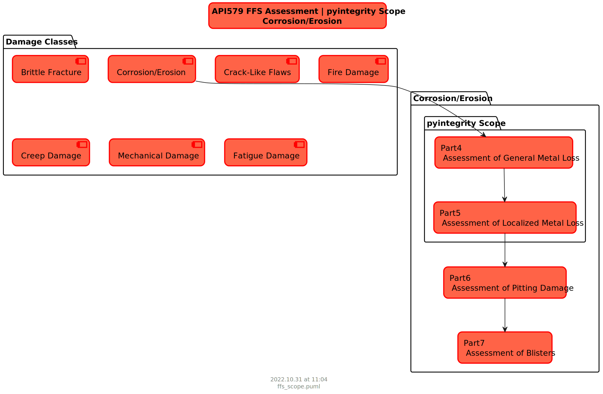

# Integrity

Fitness for service assessment is the analysis both the present integrity of the component given the current state of damage and the projected remaining life

# Summary

**#TODO**
- Refactor input file as follows
    - Divide app configuration data from input file to avoid confusion
    - Extract pipe capacity evaluation as a separate library (i.e. github and pypi)
- Currently .xlsx is supported for wall thickness grid data. Change to simple .csv
- Results are dumped into single folder
    - Divide them into high-level and detailed results into respective folders

# Usage

See examples files to set up the General Metal Loss (GML) and Local Metal Loss (LML) analysis:
- GML and LML, ASME B31.8 design code, see [12in_oil_cml28](https://github.com/vamseeachanta/pyintegrity/blob/c61594eff1455ca7741b3a61ab55e44495bb1eee/src/pyintegrity/tests/test_pyintegrity_gml_lml_b314_1.py)
- GML and LML, API 1111 design code, see [16in_gas](https://github.com/vamseeachanta/pyintegrity/blob/c61594eff1455ca7741b3a61ab55e44495bb1eee/src/pyintegrity/tests/test_pyintegrity_gml_lml_b318_1.py)

# Assumptions

# Scope

Per the API 579 damage classes, the following schematics shows the pyintegrity current scope:

# Key References

Key references used for the package development are:

| Name             | Description      | Hyperlink                                                                                |
|:-----------------|:-----------------|:----------------------------------------------------------------------------|
| API 579 | Fitness for Service, 2021 | [API 579 2021](https://blog.ansi.org/fitness-for-service-api-579-asme-ffs-1-2021/) |
| BS 7910 | Fitness for Service | [BS 7910](https://en.wikipedia.org/wiki/BS_7910) |
| BS 7910 | Fitness for Service | [BS 7910:2013 Overview](https://www.twi-global.com/technical-knowledge/published-papers/overview-of-bs79102013) |

# Existing Software

| Name             | Description      | Hyperlink                                                                                |
|:-----------------|:-----------------|:----------------------------------------------------------------------------|
| Autodesk Codeware INSPECT | Fitness for service | [FFS](https://www.codeware.com/products/inspect/api-579-1/) |
| Autodesk Codeware INSPECT GML & LML | General and Local Metal Loss | [General and Local Metal Loss](https://www.codeware.com/products/inspect/general-and-local-metal-loss/) |
| QuestIntegrity SignalFFS | Signal Fitness-For-Service (FFS) performs fitness-for-purpose and fracture mechanics analysis on fixed and rotating equipment. | [SignalFFS](https://www.questintegrity.com/software-products/signal-fitness-for-service/) |
| BMT FlawCheck | Structural Integrity Assessment Tool | [Flawcheck](https://www.bmt.org/our-innovations/bmt-flawcheck/) |
