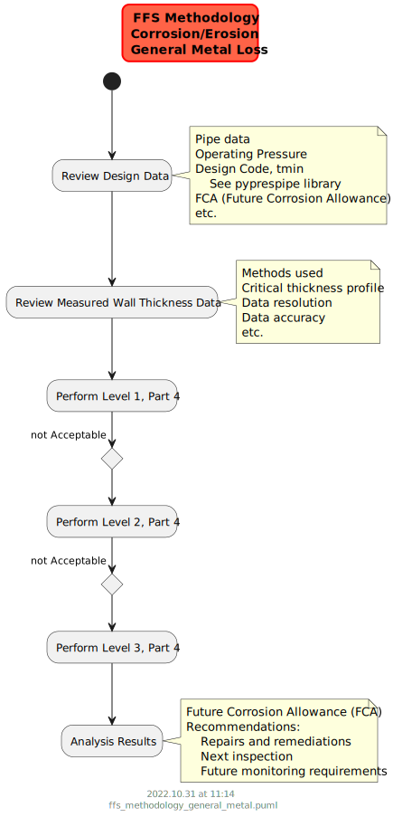
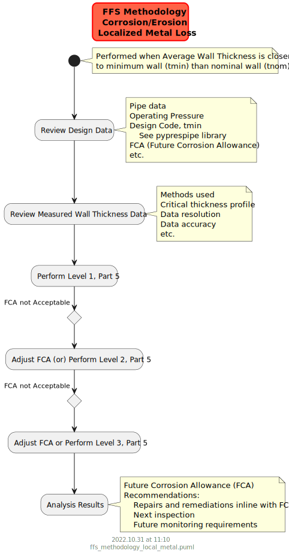

# Integrity

Fitness for service assessment is the analysis both the present integrity of the component given the current state of damage and the projected remaining life

# Summary

**#TODO**
- Refactor input file as follows 
    - Refer to pipe capacity evaluation from pipecapacity (i.e. github and pypi). simplifies master input file further
- Currently .xlsx is supported for wall thickness grid data. Change to simple .csv 
- Results are dumped into single folder
    - Divide them into high-level and detailed results into respective folders
- The detailed documentation of pyintegrity technical steps. 

# Usage

## General

See examples files to set up the General Metal Loss (GML) and Local Metal Loss (LML) analysis:
- GML and LML, ASME B31.8 design code, see [12in_oil_cml28](https://github.com/vamseeachanta/pyintegrity/blob/c61594eff1455ca7741b3a61ab55e44495bb1eee/src/pyintegrity/tests/test_pyintegrity_gml_lml_b314_1.py)
- GML and LML, API 1111 design code, see [16in_gas](https://github.com/vamseeachanta/pyintegrity/blob/c61594eff1455ca7741b3a61ab55e44495bb1eee/src/pyintegrity/tests/test_pyintegrity_gml_lml_b318_1.py)

The high level methodologies for the general metal loss (GML) and local metal loss (LML) assessments are shown below:

The detailed steps implemented in pyintegrity are per API 579, 2016 code. 

## Run tests and modify

A quick way to running code is:
- Create a virtual environment:
    - Use [conda yaml file](https://raw.githubusercontent.com/vamseeachanta/pyintegrity/master/dev_tools/environment.yml) to create a new environment
    - (or) by installing [pyintegrity]((https://github.com/vamseeachanta/pyintegrity)) package in an environment
- Run the following batch files
    - Download this [pyintegrity repository](https://github.com/vamseeachanta/pyintegrity)
    - activate environment
    - Change command line to "pyintegrity" (outside not in src) folder
    - Run the following batch files in tests:
        - python src\pyintegrity\tests\tests_api579.bat
        - python src\pyintegrity\tests\tests_fracture_mechanics.bat

# Assumptions

# Scope

Per the API 579 damage classes, the following schematics shows the pyintegrity current scope:

# Key References

Key references used for the package development are:

| Name             | Description      | Hyperlink                                                                                |
|:-----------------|:-----------------|:----------------------------------------------------------------------------|
| API 579 | Fitness for Service, 2021 | [API 579 2021](https://blog.ansi.org/fitness-for-service-api-579-asme-ffs-1-2021/) |
| BS 7910 | Fitness for Service | [BS 7910](https://en.wikipedia.org/wiki/BS_7910) |
| BS 7910 | Fitness for Service | [BS 7910:2013 Overview](https://www.twi-global.com/technical-knowledge/published-papers/overview-of-bs79102013) |

# Existing Software

| Name             | Description      | Hyperlink                                                                                |
|:-----------------|:-----------------|:----------------------------------------------------------------------------|
| Autodesk Codeware INSPECT | Fitness for service | [FFS](https://www.codeware.com/products/inspect/api-579-1/) |
| Autodesk Codeware INSPECT GML & LML | General and Local Metal Loss | [General and Local Metal Loss](https://www.codeware.com/products/inspect/general-and-local-metal-loss/) |
| QuestIntegrity SignalFFS | Signal Fitness-For-Service (FFS) performs fitness-for-purpose and fracture mechanics analysis on fixed and rotating equipment. | [SignalFFS](https://www.questintegrity.com/software-products/signal-fitness-for-service/) |
| BMT FlawCheck | Structural Integrity Assessment Tool | [Flawcheck](https://www.bmt.org/our-innovations/bmt-flawcheck/) |
| Blade Energy Dent Analyzer™ | Strain Based Dent Analysis tool for pipeline integrity management based on ASME B31.8 Appendix R and improved strain equation for pipeline industry | [Dent Analyzer™](https://www.blade-energy.com/software/) |
| Blade Energy Crack Analyzer™ | Crack assessment tool for pipeline integrity management based on API 579 and BS 7910 for pipeline industry | [Crack Analyzer™](https://www.blade-energy.com/software/) |
